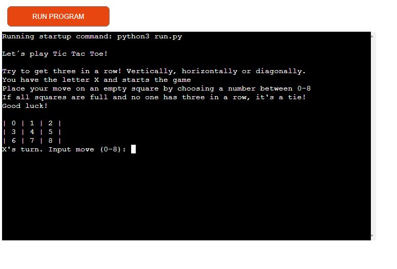
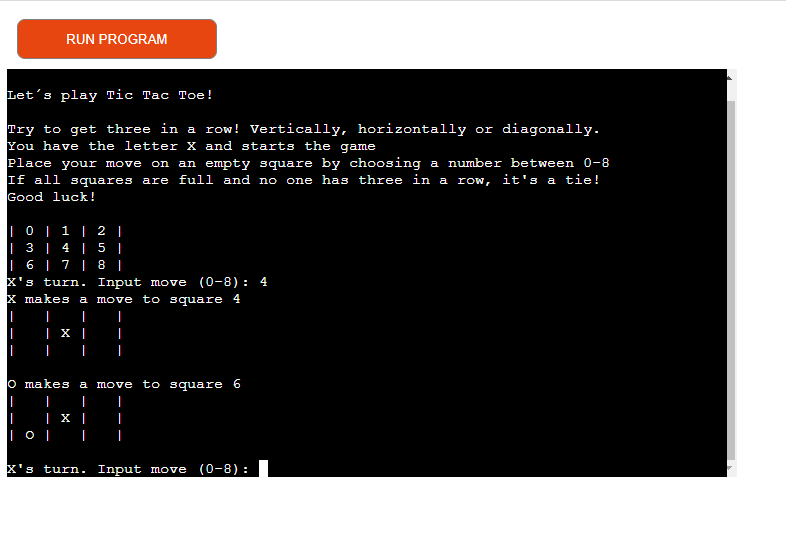
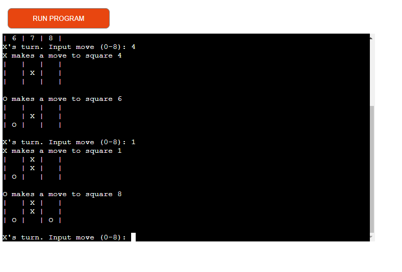
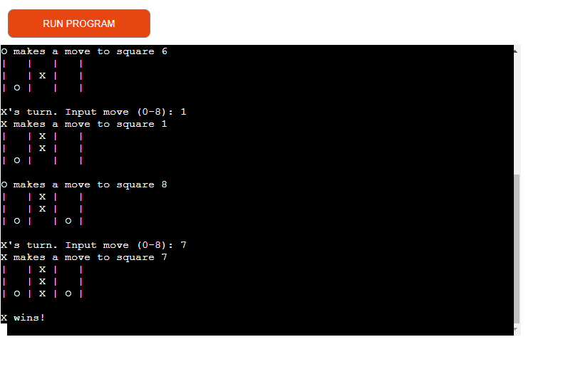
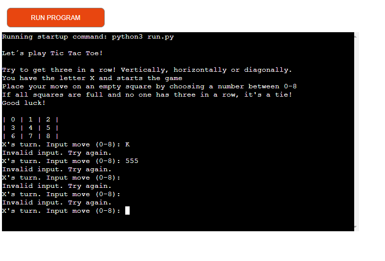
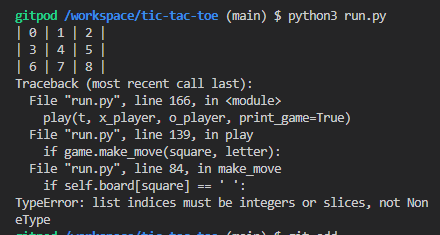
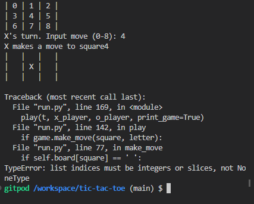

# Tic Tac Toe

Tic Tac Toe, a game created for the Project Portfolio 3 at Code Institute.
A game where two players (one is the computer) takes turn making moves on a gameboard with 9 squares. Placing out X or O and try to get three in a row.  

[View Tic Tac Toe live](https://github.com/MaryAnneLee/tic-tac-toe)

---

## CONTENTS

* [User Experience](#user-experience-ux)
  * [User Stories](#user-stories)

* [Features](#features)

* [Technologies Used](#technologies-used)
  * [Languages Used](#languages-used)
  * [Frameworks, Libraries & Programs Used](#frameworks-libraries--programs-used)

* [Deployment](#deployment)
  * [Deployment](#deployment)
    * [How to Fork](#how-to-fork)
    * [How to Clone](#how-to-clone)

* [Testing](#testing)

* [Credits](#credits)
  * [Code Used](#code-used)
  * [Content](#content)
  * [Acknowledgments](#acknowledgments)

---

## User experience (UX)
---
### User stories
A simple game to play for fun.

## Features
---
When the game runs the player see instructions to the game and information to make their first move.

When the first move is made the computer makes a move and the information is visible on the screen.

The player and computer takes turn in making moves.

The first to get three in a row wins!

When player enters a invalid input like a letter,number, space or just enter that's not part of the game, information goes out to try again. 

## Technologies Used
---
### Languages Used

- Python

### Frameworks, Libraries & Programs Used

- Github
- Gitpod
- Heroku
- Pep8 CI Python Linter

## Deployment & Local Development
---
### Deployment

The instructions to deploy this project:

- Log in to Heroku or create an account
- On the main page click the button New in the top right corner and from the drop-down menu select Create new app
- Enter a unique app name
- Select your region
 - Click on the Create app button
- On the overview page choose Settings and scroll down to Config vars
- Click Reveal config vars and enter PORT into the Key box and 8000 into the Value box and then click Add
- Scroll down to the Buildpack section click Add buildpack. Select Python and click Save changes
- Click Add buildpack again and select node.js 
Note: The Buildpacks must be in the correct order with Python first. 
- Scroll to the top of the page and choose the Deploy tab
- Select Github as the deployment method
- Confirm you want to connect to GitHub
- Search for the repository name and click the connect button
- Scroll to the bottom of the deploy page and select deployment type
- Click Enable automatic deploys for automatic deployment when you push updates to Github

#### How to Fork

To fork this repository:

- Log in (or sign up) to Github.
- Go to the repository for this project, MaryAnneLee/tic-tac-toe
- Click the Fork button in the top right corner.

#### How to Clone

To clone this repository:

- Log in (or sign up) to GitHub.
- Go to the repository for this project, MaryAnneLee/tic-tac-toe
- Click on the code button, select whether you would like to clone with HTTPS, SSH or GitHub CLI and copy the link shown.
- Open the terminal in your code editor and change the current working directory to the location you want to use for the cloned directory.
- Type 'git clone' into the terminal and then paste the link you copied in step 3. Press enter.

## Testing
---
- At first there were some indentations issuses (but not mentioning the indentations below), one line to long and some white spaces. All of that is fixed as screenshot shows. 

### Solved bugs

1.   When trying to run the game in gitpod terminal - it doesn't work. No game board is visible in the terminal. 
Solutions: Found one line missing in the  code (deleted by mistake?) and a spelling mistake. Still doesn’t run after changes.

Asked some of my classmates on Slack about my problem and got the tip to remove one line of the code.
That made the game board visible but showed errors (Bug nr 2.)

2. 

Solution: Went through the code again and found an indentation error for the Human player. Fixed that and the game starts and the first move is made, but a new error after that. (Bug nr.3)

3. 

Same indentation error for the computer player. Fixed that and after that the game runs as it should.

## Credits
---
### Code Used

- Code came from a tutorial on YouTube that I followed. Only nine days to learn Python and create a project isn't enough time for me to do it all on my own. 

[12 beginner Python projects from freeCodeCamp.org](https://www.youtube.com/watch?v=8ext9G7xspg)
 
- The Readme template came orginally from [Kera Cudmore](https://github.com/kera-cudmore/readme-examples/blob/main/milestone1-readme.md) but changes made by me with every new project. 

### Content

Written by Anne-Lie Smith following a tutorial On YouTube.
 
  
###  Acknowledgments

A special thanks to peolpe that helped me complete my third portfolio project!
- Martina Terlevic, my Code institute mentor.
- Paul Thomas O'Riordan for helping out with questions in our Slack class channel.
- Kera Cudmore, for all the information about the Readme-file.
- My fellow class mates Johan, Mark and Thomas.   