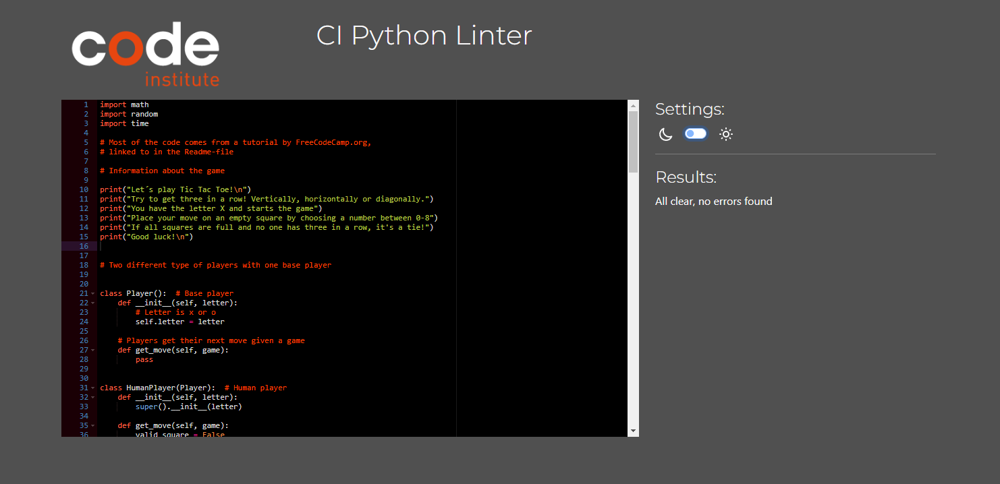

# Tic Tac Toe

Tic Tac Toe , a game created for the Project Portfolio 3 at Code Institute.

[View Tic Tac Toe on Github pages](https://github.com/MaryAnneLee/tic-tac-toe)

---

## CONTENTS

* [User Experience](#user-experience-ux)
  * [User Stories](#user-stories)

* [Features](#features)
  * [Future Implementations](#future-implementations)
  * [Accessibility](#accessibility)

* [Technologies Used](#technologies-used)
  * [Languages Used](#languages-used)
  * [Frameworks, Libraries & Programs Used](#frameworks-libraries--programs-used)

* [Deployment & Local Development](#deployment--local-development)
  * [Deployment](#deployment)
  * [Local Development](#local-development)
    * [How to Fork](#how-to-fork)
    * [How to Clone](#how-to-clone)

* [Testing](#testing)

* [Credits](#credits)
  * [Code Used](#code-used)
  * [Content](#content)
  * [Acknowledgments](#acknowledgments)

---

## User experience (UX)

Tic Tac Toe is a game to play for fun.

### User stories
A simple and fun game to play. 

#### User goals
To play a fun game.
To  play a game that is easy to navigate and understand.

## Features

## Technologies Used

### Languages Used

- Python

### Frameworks, Libraries & Programs Used

- Github
- Gitpod
- Heroku
- Pep8
- w3 schools

## Deployment & Local Development

### Deployment

The instructions to deploy this project:

- Log in to Heroku or create an account
- On the main page click the button labelled New in the top right corner and from the drop-down menu select Create New App
- Enter a unique app name
- Select your region
 - Click on the Create App button
- The next page is the project’s Deploy Tab. Click on the Settings Tab and scroll down to Config Vars
- Click Reveal Config Vars and enter port into the Key box and 8000 into the Value box and click the Add button
- (Click Reveal Config Vars again and enter CREDS into the Key box and the Google credentials into the Value box)
- Scroll down to the Buildpack section click Add Buildpack select python and click Save Changes
- Click Add Buildpack again and select node.js Note: The Buildpacks must be in the correct order with Python first. 
- Scroll to the top of the page and choose the Deploy tab
- Select Github as the deployment method
- Confirm you want to connect to GitHub
- Search for the repository name and click the connect button
- Scroll to the bottom of the deploy page and select the preferred deployment type
- Click Enable Automatic Deploys for automatic deployment when you push updates to Github

### Local Development

#### How to Fork

To fork this repository:

- Log in (or sign up) to Github.
- Go to the repository for this project, MaryAnneLee/tic-tac-toe
- Click the Fork button in the top right corner.

#### How to Clone

To clone this repository:

- Log in (or sign up) to GitHub.
- Go to the repository for this project, MaryAnneLee/tic-tac-toe
- Click on the code button, select whether you would like to clone with HTTPS, SSH or GitHub CLI and copy the link shown.
- Open the terminal in your code editor and change the current working directory to the location you want to use for the cloned directory.
- Type 'git clone' into the terminal and then paste the link you copied in step 3. Press enter.

## Testing

- 

- Lighthouse testing

### Solved bugs

1.   

## Credits

### Code Used

- Code came from a tutorial on YouTube that I followed. Only nine days to learn Python and create a project isn't enough time for me to do it all on my own. 
 - [12 beginner Python projects from freeCodeCamp.org](https://www.youtube.com/watch?v=8ext9G7xspg)
 
- The Readme template came orginally from [Kera Cudmore](https://github.com/kera-cudmore/readme-examples/blob/main/milestone1-readme.md) but changes with every project. 

### Content

Written by Anne-Lie Smith following a tutorial On YouTube.
 
  
###  Acknowledgments

A special thanks to peolpe that helped me complete my first portfolio project!
- Martina Terlevic, my Code institute mentor.
- Paul Thomas O'Riordan for helping out with questions in our Slack class channel.
- Kera Cudmore, for all the information about the Readme-file.
- My fellow class mates Johan, Mark and Thomas.   